# UML Completo — Valentim

Este documento descreve a estrutura UML completa do projeto **Valentim**, um sistema de gestão operacional para escritórios contábeis.

A documentação usa **Mermaid**, que é renderizado diretamente pelo GitHub em arquivos Markdown.

---

# 1. Visão Geral do Sistema

O Valentim é uma plataforma web para:

- cadastrar clientes;
- cadastrar empresas;
- controlar documentos mensais;
- receber uploads;
- controlar prazos e vencimentos;
- gerar alertas;
- registrar atendimentos;
- controlar honorários;
- criar propostas comerciais;
- manter auditoria de ações importantes.

---

# 2. Atores do Sistema

## Atores principais

```txt
Administrador do Escritório
Funcionário do Escritório
Cliente do Escritório
Sistema de E-mail
Serviço de Storage
Sistema de Autenticação
```

## Responsabilidades

| Ator | Responsabilidade |
|---|---|
| Administrador | Gerencia usuários, clientes, empresas, documentos, financeiro e configurações |
| Funcionário | Opera documentos, prazos, atendimento e conferências |
| Cliente | Envia documentos e acompanha pendências |
| Sistema de E-mail | Envia notificações futuras |
| Serviço de Storage | Armazena arquivos enviados |
| Sistema de Autenticação | Garante acesso seguro às rotas privadas |

---

# 3. Diagrama UML de Casos de Uso Geral

```mermaid
usecaseDiagram
actor Admin as "Administrador"
actor Staff as "Funcionário"
actor Client as "Cliente"
actor Email as "Serviço de E-mail"
actor Storage as "Serviço de Storage"

rectangle "Valentim" {
  usecase UC1 as "Fazer login"
  usecase UC2 as "Gerenciar usuários"
  usecase UC3 as "Cadastrar clientes"
  usecase UC4 as "Cadastrar empresas"
  usecase UC5 as "Solicitar documentos"
  usecase UC6 as "Enviar documentos"
  usecase UC7 as "Conferir documentos"
  usecase UC8 as "Recusar documentos"
  usecase UC9 as "Controlar prazos"
  usecase UC10 as "Gerar alertas"
  usecase UC11 as "Registrar atendimento"
  usecase UC12 as "Controlar honorários"
  usecase UC13 as "Criar propostas"
  usecase UC14 as "Visualizar dashboard"
  usecase UC15 as "Auditar ações"
  usecase UC16 as "Enviar e-mails"
  usecase UC17 as "Armazenar arquivos"
}

Admin --> UC1
Staff --> UC1
Client --> UC1

Admin --> UC2
Admin --> UC3
Admin --> UC4
Admin --> UC5
Admin --> UC7
Admin --> UC8
Admin --> UC9
Admin --> UC10
Admin --> UC11
Admin --> UC12
Admin --> UC13
Admin --> UC14
Admin --> UC15

Staff --> UC3
Staff --> UC4
Staff --> UC5
Staff --> UC7
Staff --> UC8
Staff --> UC9
Staff --> UC10
Staff --> UC11
Staff --> UC14

Client --> UC6
Client --> UC14

UC6 --> UC17
UC10 --> UC16
Storage --> UC17
Email --> UC16
```

---

# 4. Diagrama de Casos de Uso — Documentos

```mermaid
usecaseDiagram
actor Admin as "Administrador"
actor Staff as "Funcionário"
actor Client as "Cliente"
actor Storage as "Storage"

rectangle "Módulo de Documentos" {
  usecase D1 as "Criar solicitação de documento"
  usecase D2 as "Listar pendências"
  usecase D3 as "Filtrar por cliente"
  usecase D4 as "Filtrar por mês"
  usecase D5 as "Enviar arquivo"
  usecase D6 as "Validar arquivo"
  usecase D7 as "Salvar arquivo"
  usecase D8 as "Marcar como enviado"
  usecase D9 as "Colocar em análise"
  usecase D10 as "Aprovar documento"
  usecase D11 as "Recusar documento"
  usecase D12 as "Informar motivo da recusa"
  usecase D13 as "Baixar arquivo"
  usecase D14 as "Registrar log de auditoria"
}

Admin --> D1
Staff --> D1
Admin --> D2
Staff --> D2
Admin --> D3
Staff --> D3
Admin --> D4
Staff --> D4
Client --> D5
D5 --> D6
D6 --> D7
D7 --> D8
Storage --> D7
Admin --> D9
Staff --> D9
Admin --> D10
Staff --> D10
Admin --> D11
Staff --> D11
D11 --> D12
Admin --> D13
Staff --> D13
Client --> D13
D5 --> D14
D10 --> D14
D11 --> D14
```

---

# 5. Diagrama de Casos de Uso — Financeiro

```mermaid
usecaseDiagram
actor Admin as "Administrador"
actor Staff as "Funcionário"

rectangle "Módulo Financeiro" {
  usecase F1 as "Cadastrar cobrança"
  usecase F2 as "Listar cobranças"
  usecase F3 as "Filtrar por status"
  usecase F4 as "Marcar como paga"
  usecase F5 as "Marcar como atrasada"
  usecase F6 as "Cancelar cobrança"
  usecase F7 as "Visualizar total em aberto"
  usecase F8 as "Registrar log financeiro"
}

Admin --> F1
Admin --> F2
Admin --> F3
Admin --> F4
Admin --> F5
Admin --> F6
Admin --> F7
Admin --> F8

Staff --> F2
Staff --> F3
Staff --> F7

F4 --> F8
F5 --> F8
F6 --> F8
```

---

# 6. Diagrama de Classes — Domínio Completo

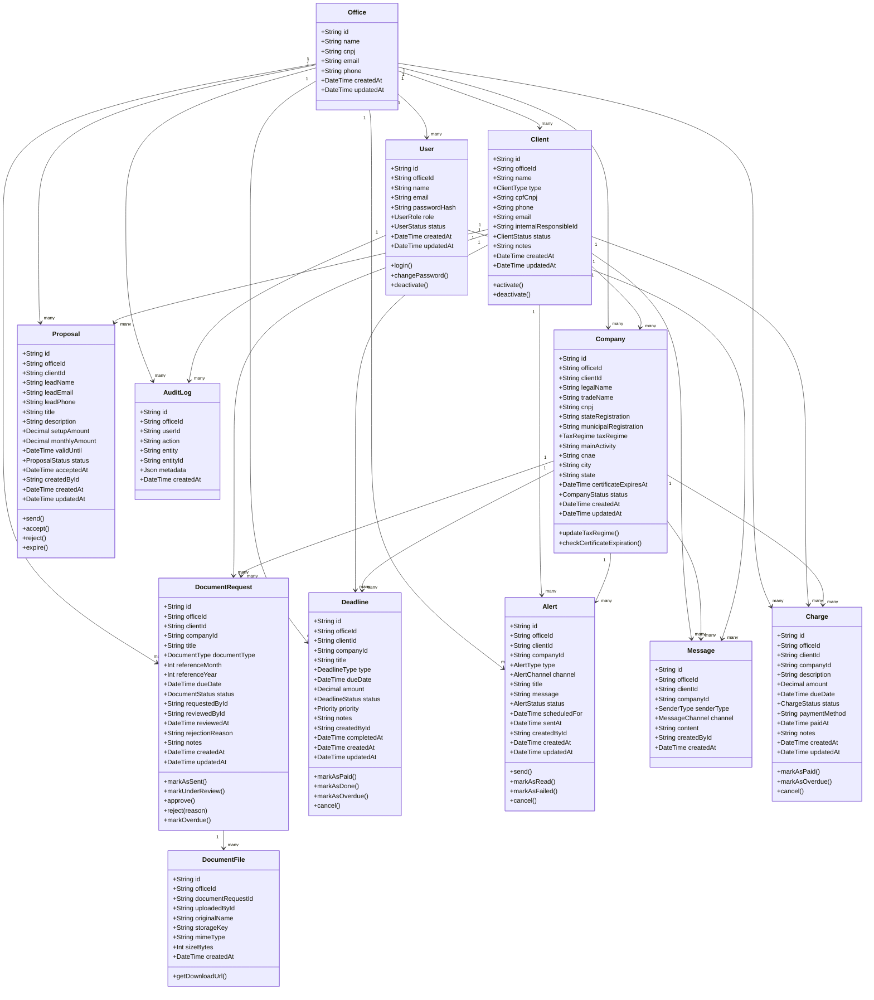

---

# 7. Enums do Domínio

```mermaid
classDiagram
class UserRole {
  <<enumeration>>
  ADMIN
  STAFF
  CLIENT
}

class UserStatus {
  <<enumeration>>
  ACTIVE
  INACTIVE
  BLOCKED
}

class ClientType {
  <<enumeration>>
  PERSON
  COMPANY
}

class ClientStatus {
  <<enumeration>>
  ACTIVE
  INACTIVE
  PROSPECT
}

class CompanyStatus {
  <<enumeration>>
  ACTIVE
  INACTIVE
}

class TaxRegime {
  <<enumeration>>
  MEI
  SIMPLES_NACIONAL
  LUCRO_PRESUMIDO
  LUCRO_REAL
  PESSOA_FISICA
  OUTRO
}

class DocumentStatus {
  <<enumeration>>
  PENDING
  SENT
  UNDER_REVIEW
  APPROVED
  REJECTED
  OVERDUE
}

class DocumentType {
  <<enumeration>>
  NOTAS_ENTRADA
  NOTAS_SAIDA
  EXTRATO_BANCARIO
  COMPROVANTES_DESPESAS
  FOLHA_PAGAMENTO
  PRO_LABORE
  CONTRATOS
  XML
  DAS_PAGO
  DARF_PAGO
  RECIBOS
  OUTROS
}

class DeadlineType {
  <<enumeration>>
  DAS
  DARF
  INSS
  FGTS
  ISS
  HONORARIOS
  CERTIFICADO_DIGITAL
  ALVARA
  CONTRATO
  OBRIGACAO_ACESSORIA
  OUTRO
}

class DeadlineStatus {
  <<enumeration>>
  OPEN
  PAID
  DONE
  OVERDUE
  CANCELED
}

class Priority {
  <<enumeration>>
  LOW
  MEDIUM
  HIGH
  URGENT
}

class AlertChannel {
  <<enumeration>>
  SYSTEM
  EMAIL
  WHATSAPP
}

class AlertStatus {
  <<enumeration>>
  PENDING
  SENT
  READ
  FAILED
  CANCELED
}

class ChargeStatus {
  <<enumeration>>
  OPEN
  PAID
  OVERDUE
  CANCELED
}

class ProposalStatus {
  <<enumeration>>
  DRAFT
  SENT
  ACCEPTED
  REJECTED
  EXPIRED
}

class SenderType {
  <<enumeration>>
  OFFICE
  CLIENT
  SYSTEM
}
```

---

# 8. Diagrama de Componentes

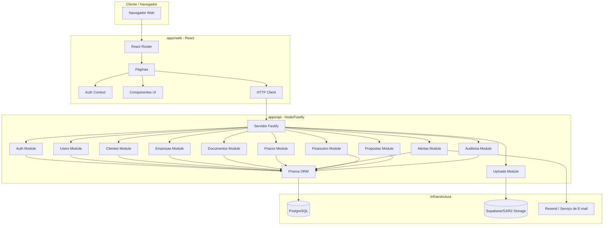

---

# 9. Diagrama de Pacotes / Estrutura do Código

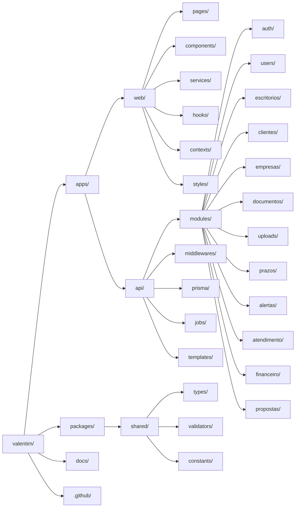

---

# 10. Diagrama de Sequência — Login

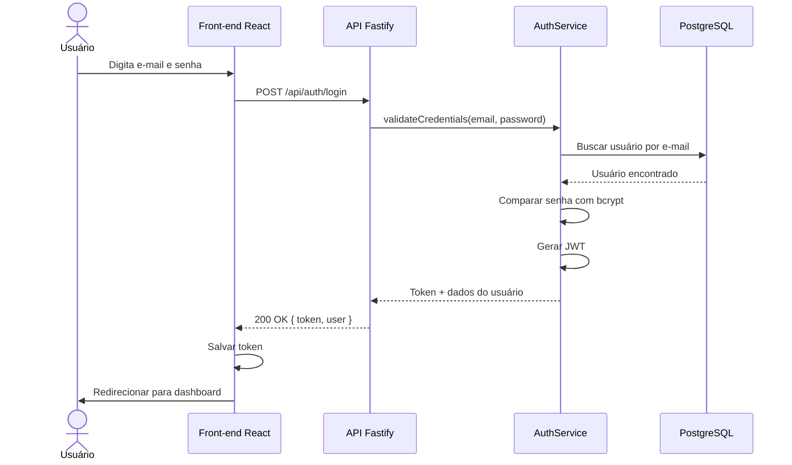

---

# 11. Diagrama de Sequência — Cadastro de Cliente

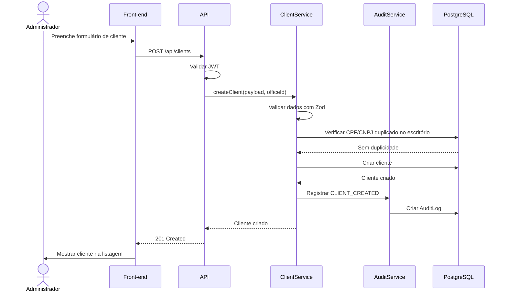

---

# 12. Diagrama de Sequência — Solicitação e Upload de Documento

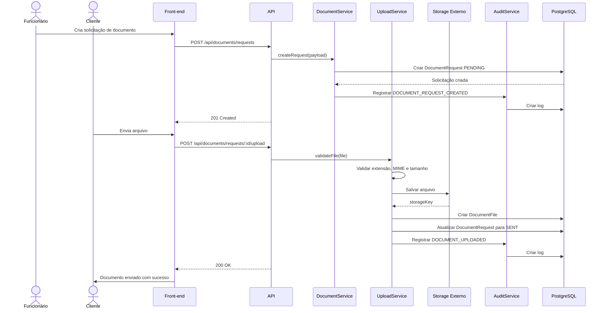

---

# 13. Diagrama de Sequência — Conferência de Documento

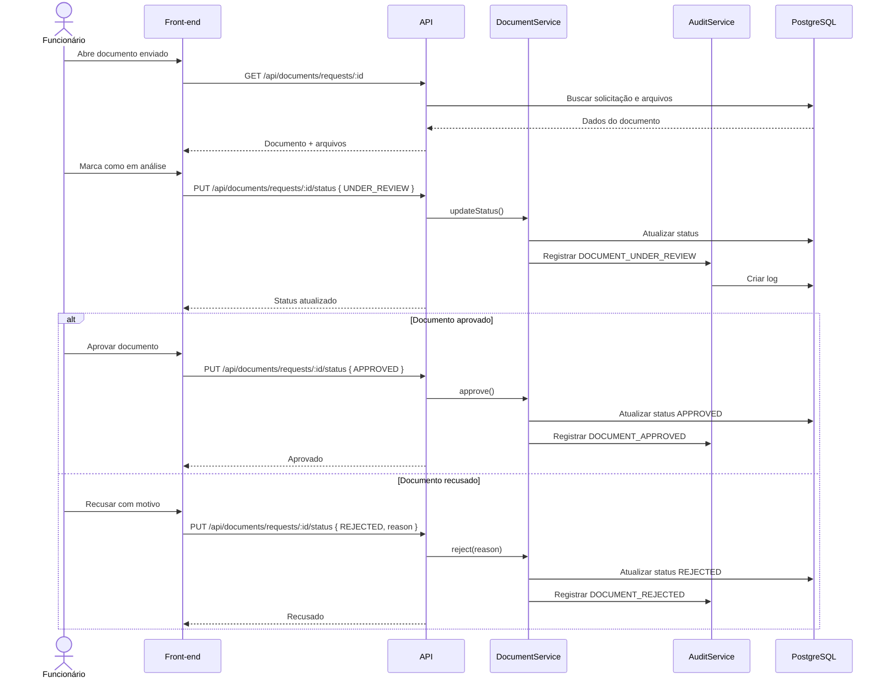

---

# 14. Diagrama de Sequência — Criação de Prazo

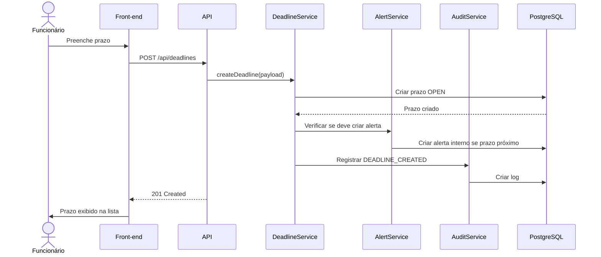

---

# 15. Diagrama de Sequência — Alerta Manual

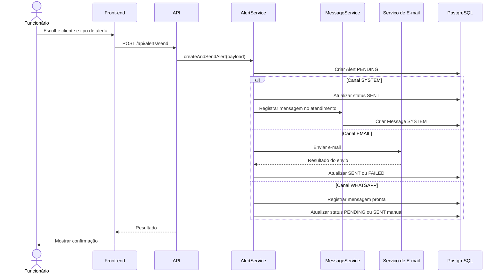

---

# 16. Diagrama de Sequência — Cobrança Financeira

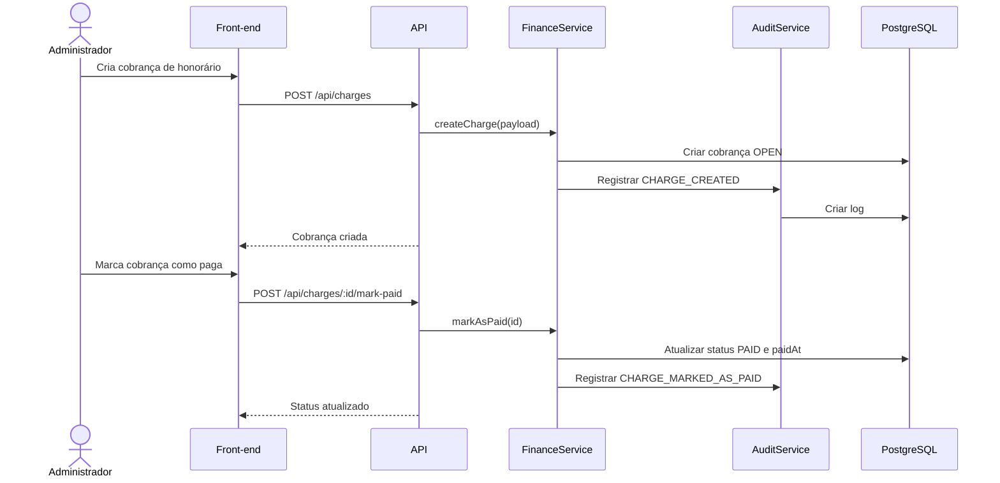

---

# 17. Diagrama de Atividade — Fluxo de Documento

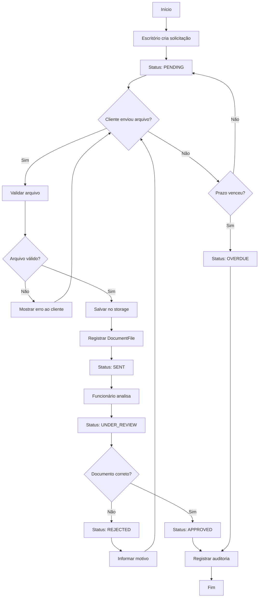

---

# 18. Diagrama de Atividade — Fluxo de Cliente

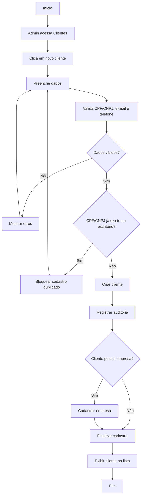

---

# 19. Diagrama de Atividade — Fluxo de Proposta

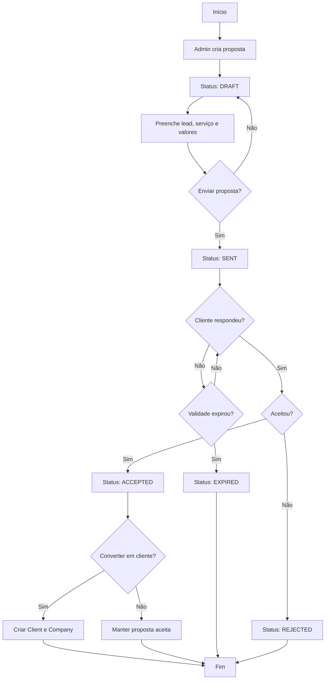

---

# 20. Diagrama de Estados — DocumentRequest

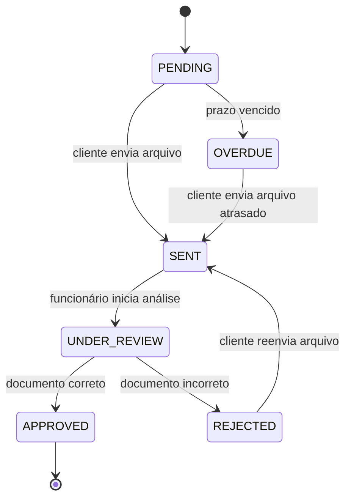

---

# 21. Diagrama de Estados — Deadline

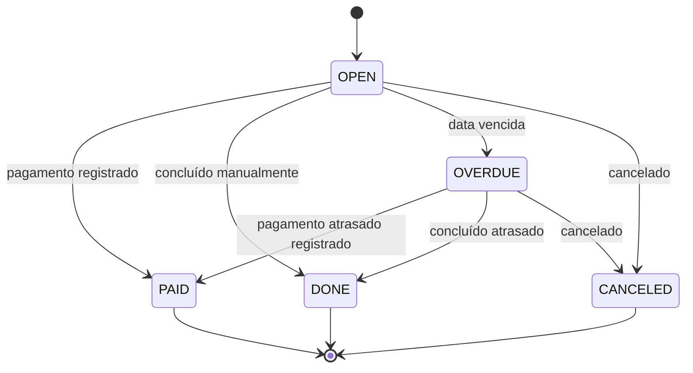

---

# 22. Diagrama de Estados — Charge

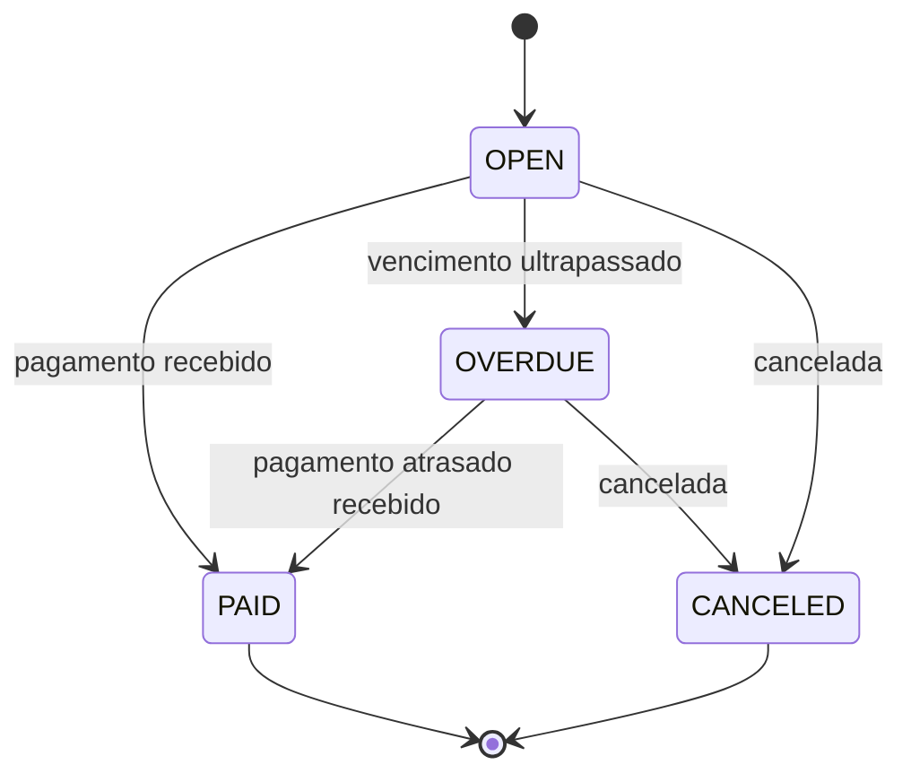

---

# 23. Diagrama de Estados — Proposal

```mermaid
stateDiagram-v2
  [*] --> DRAFT

  DRAFT --> SENT: proposta enviada
  SENT --> ACCEPTED: cliente aceitou
  SENT --> REJECTED: cliente recusou
  SENT --> EXPIRED: validade expirou

  ACCEPTED --> [*]
  REJECTED --> [*]
  EXPIRED --> [*]
```

---

# 24. Diagrama ER Simplificado

```mermaid
erDiagram
  OFFICE ||--o{ USER : has
  OFFICE ||--o{ CLIENT : has
  OFFICE ||--o{ COMPANY : has
  OFFICE ||--o{ DOCUMENT_REQUEST : has
  OFFICE ||--o{ DEADLINE : has
  OFFICE ||--o{ ALERT : has
  OFFICE ||--o{ MESSAGE : has
  OFFICE ||--o{ CHARGE : has
  OFFICE ||--o{ PROPOSAL : has
  OFFICE ||--o{ AUDIT_LOG : has

  CLIENT ||--o{ COMPANY : owns
  CLIENT ||--o{ DOCUMENT_REQUEST : has
  CLIENT ||--o{ DEADLINE : has
  CLIENT ||--o{ ALERT : receives
  CLIENT ||--o{ MESSAGE : has
  CLIENT ||--o{ CHARGE : has
  CLIENT ||--o{ PROPOSAL : has

  COMPANY ||--o{ DOCUMENT_REQUEST : requires
  COMPANY ||--o{ DEADLINE : has
  COMPANY ||--o{ ALERT : receives
  COMPANY ||--o{ MESSAGE : has
  COMPANY ||--o{ CHARGE : has

  DOCUMENT_REQUEST ||--o{ DOCUMENT_FILE : contains
  USER ||--o{ AUDIT_LOG : performs

  OFFICE {
    string id PK
    string name
    string cnpj
    string email
    string phone
    datetime createdAt
    datetime updatedAt
  }

  USER {
    string id PK
    string officeId FK
    string name
    string email
    string passwordHash
    string role
    string status
  }

  CLIENT {
    string id PK
    string officeId FK
    string name
    string type
    string cpfCnpj
    string phone
    string email
    string status
  }

  COMPANY {
    string id PK
    string officeId FK
    string clientId FK
    string legalName
    string tradeName
    string cnpj
    string taxRegime
    string status
  }

  DOCUMENT_REQUEST {
    string id PK
    string officeId FK
    string clientId FK
    string companyId FK
    string title
    string documentType
    int referenceMonth
    int referenceYear
    datetime dueDate
    string status
  }

  DOCUMENT_FILE {
    string id PK
    string officeId FK
    string documentRequestId FK
    string originalName
    string storageKey
    string mimeType
    int sizeBytes
  }

  DEADLINE {
    string id PK
    string officeId FK
    string clientId FK
    string companyId FK
    string title
    string type
    datetime dueDate
    decimal amount
    string status
    string priority
  }

  ALERT {
    string id PK
    string officeId FK
    string clientId FK
    string companyId FK
    string channel
    string status
    string title
    string message
  }

  CHARGE {
    string id PK
    string officeId FK
    string clientId FK
    string companyId FK
    string description
    decimal amount
    datetime dueDate
    string status
  }

  PROPOSAL {
    string id PK
    string officeId FK
    string clientId FK
    string leadName
    string title
    decimal setupAmount
    decimal monthlyAmount
    string status
  }
```

---

# 25. Diagrama de Implantação

```mermaid
flowchart TB
  subgraph UserDevice["Dispositivo do Usuário"]
    Browser["Navegador"]
  end

  subgraph Vercel["Vercel / Front-end Hosting"]
    WebApp["React App"]
  end

  subgraph ApiHost["Render / Railway / Fly.io"]
    ApiApp["Node.js Fastify API"]
    Env["Variáveis de Ambiente"]
  end

  subgraph DatabaseHost["Supabase / Neon / Railway"]
    Postgres[(PostgreSQL)]
  end

  subgraph StorageHost["Supabase Storage / S3 / R2"]
    Files[(Arquivos dos Clientes)]
  end

  subgraph EmailHost["Resend"]
    EmailService["Serviço de E-mail"]
  end

  Browser --> WebApp
  WebApp --> ApiApp
  ApiApp --> Postgres
  ApiApp --> Files
  ApiApp --> EmailService
  ApiApp --> Env
```

---

# 26. Diagrama de Fluxo de Navegação do Front-end

```mermaid
flowchart TD
  A[Login] --> B{Autenticado?}
  B -- Não --> A
  B -- Sim --> C[Layout Privado]

  C --> D[Dashboard]
  C --> E[Atendimento]
  C --> F[Clientes]
  C --> G[Empresas]
  C --> H[Documentos]
  C --> I[Prazos]
  C --> J[Alertas]
  C --> K[Financeiro]
  C --> L[Propostas]
  C --> M[Configurações]

  F --> F1[Lista de Clientes]
  F --> F2[Novo Cliente]
  F --> F3[Detalhe do Cliente]
  F3 --> F4[Empresas do Cliente]
  F3 --> F5[Documentos do Cliente]
  F3 --> F6[Financeiro do Cliente]

  H --> H1[Pendências]
  H --> H2[Nova Solicitação]
  H --> H3[Detalhe do Documento]
  H3 --> H4[Upload]
  H3 --> H5[Conferência]

  I --> I1[Calendário]
  I --> I2[Lista de Prazos]
  I --> I3[Novo Prazo]

  K --> K1[Cobranças]
  K --> K2[Nova Cobrança]
  K --> K3[Inadimplentes]

  L --> L1[Lista de Propostas]
  L --> L2[Nova Proposta]
  L --> L3[Detalhe da Proposta]
```

---

# 27. Diagrama Interno de um Módulo da API

Todo módulo deve seguir o padrão abaixo.

```mermaid
flowchart LR
  Route["*.routes.ts"] --> Controller["*.controller.ts"]
  Controller --> Schema["*.schemas.ts / Zod"]
  Controller --> Service["*.service.ts"]
  Service --> Repository["*.repository.ts"]
  Repository --> Prisma["Prisma Client"]
  Prisma --> DB[(PostgreSQL)]
  Service --> Audit["Audit Service"]
```

Exemplo para clientes:

```txt
clientes.routes.ts
clientes.controller.ts
clientes.service.ts
clientes.repository.ts
clientes.schemas.ts
clientes.types.ts
```

---

# 28. Diagrama de Permissões

```mermaid
flowchart TD
  User[Usuário] --> Role{Role}

  Role --> Admin[ADMIN]
  Role --> Staff[STAFF]
  Role --> Client[CLIENT]

  Admin --> A1[Gerenciar usuários]
  Admin --> A2[Gerenciar clientes]
  Admin --> A3[Gerenciar empresas]
  Admin --> A4[Gerenciar documentos]
  Admin --> A5[Gerenciar prazos]
  Admin --> A6[Gerenciar financeiro]
  Admin --> A7[Gerenciar propostas]
  Admin --> A8[Configurações]

  Staff --> S1[Ver clientes]
  Staff --> S2[Conferir documentos]
  Staff --> S3[Controlar prazos]
  Staff --> S4[Registrar atendimento]
  Staff --> S5[Ver dashboard]

  Client --> C1[Ver próprias pendências]
  Client --> C2[Enviar documentos]
  Client --> C3[Ver próprios prazos]
  Client --> C4[Ver mensagens]
```

---

# 29. Diagrama de Jobs e Rotinas Automáticas

```mermaid
flowchart TD
  Scheduler[Agendador de Rotinas] --> J1[Gerar pendências mensais]
  Scheduler --> J2[Marcar documentos vencidos]
  Scheduler --> J3[Marcar prazos vencidos]
  Scheduler --> J4[Gerar alertas de documentos]
  Scheduler --> J5[Gerar alertas de prazos]
  Scheduler --> J6[Marcar propostas expiradas]
  Scheduler --> J7[Marcar cobranças atrasadas]

  J1 --> DB[(PostgreSQL)]
  J2 --> DB
  J3 --> DB
  J4 --> DB
  J5 --> DB
  J6 --> DB
  J7 --> DB

  J4 --> AlertService[AlertService]
  J5 --> AlertService
  AlertService --> Email[Email Futuro]
```

---

# 30. Diagrama de Contexto C4 Simplificado

```mermaid
flowchart TB
  Admin[Administrador]
  Staff[Funcionário]
  Client[Cliente]

  Valentim["Valentim\nSistema de Gestão Contábil"]

  Email[Serviço de E-mail]
  Storage[Storage de Arquivos]
  DB[(Banco PostgreSQL)]

  Admin --> Valentim
  Staff --> Valentim
  Client --> Valentim

  Valentim --> Email
  Valentim --> Storage
  Valentim --> DB
```

---

# 31. Regras que Devem Ser Respeitadas na Implementação

1. Todo dado deve ser filtrado por `officeId`.
2. Nenhuma senha pode ser salva sem hash.
3. Upload precisa validar extensão, MIME e tamanho.
4. Documento recusado deve permitir reenvio.
5. Dashboard deve usar dados reais, não mock.
6. Financeiro deve usar Decimal.
7. Arquivos não devem ser salvos no Git.
8. Logs devem registrar ações críticas.
9. WhatsApp automático não deve ser requisito do MVP.
10. O sistema deve começar simples e evoluir por fases.

---

# 32. Próximos Diagramas Futuramente

Quando o código começar, podem ser adicionados:

- diagrama por módulo real;
- diagrama do schema Prisma definitivo;
- diagrama de CI/CD;
- diagrama de deploy por ambiente;
- diagrama de testes;
- diagrama de integrações externas;
- diagrama de eventos internos.
